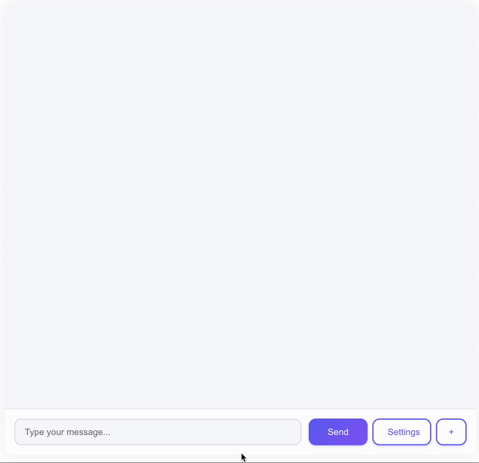

# FastAPI Chat App Template 


This repository contains a quick start for creating a chat app with a FastAPI server.



## Getting Started

### Project structure

```
.
├── api/
│   ├── __init__.py
│   ├── llm         # business logic for calling llm
│   ├── controller  # interface connecting app logic to the router
│   ├── main.py     # define application
│   ├── models.py   # define request models here
│   ├── router.py   # define routes here
│   └── settings.py # interface for using environment variables
├── build/          # directory built by `yarn build`
├── client/         # client code (typescript)
├── config/         # js config files, shouldn't need to modify
├── docker/         # docker config files
│   └── Dockerfile
├── node_modules/   # client dependencies generated by `yarn install`
│   └── ...
├── scripts/
├── venv/           # virtual environment
├── example.env     # file showing what environment variables to put in .env file
├── .env            # .env file defining values that will be pulled in during development
├── package.json            # react app config
├── requirements.txt        # python production dependencies
├── requirements-dev.txt    # dev dependencies
...
└── docker-compose.yml      # local docker run configuration

```
 
### Prerequisites
1. Ensure you have python installed (this project was built with [Python 3.11](https://www.python.org/downloads/release/python-3119/))

Create a virtual environment with `venv`
```bash
# install virtualenv (if not already installed)
pip install -m virtualenv
# create the new virtual environment
python -m virtualenv venv

# activate the virtual environement
# windows
./venv/Scripts/activate
# mac / linux
source ./venv/bin/activate
```
2. Ensure you have [node](https://nodejs.org/en/download/package-manager) installed.
3. Install yarn

```bash
npm install -g yarn
```

### Prepare your Development Environment
#### Python
```bash
pip install -r requirements-dev.txt
```

To install all the necessary dependencies for python.

#### Client
Run the following command to install the client dependencies:

```bash
# install deps
yarn install
# build client application
# if you don't do this, `yarn start:server` in the next step will fail!
yarn build
```
#### Environment Variables
Next create a `.env` file in the root directory and copy/paste the keys from [`./example.env`](./example.env). 

Replace the values with actual api-keys/model names.

### Run the App!
I included a command to start the server in development mode, which can be found in the [package.json](./package.json) under the "scripts" key.

```bash
yarn start:server
```

The server will listen to any changes in the project and will reload for you so you don't have to continue re-running that command.

### Running with Docker

Follow [Docker's instructions](https://www.docker.com/get-started/) on getting started if you don't already have docker installed.

#### `docker run`

First we must build the api/client
```bash
docker build -t chat -f ./docker/Dockerfile .
```

Next we can run the application
```bash
docker run --env-file .env -p 8080:8080 chat
```

#### Docker Compose

First we must build the api/client
```bash
docker-compose build
```

Run the built app
```bash
# run detached
docker-compose up -d 
# spin things down
docker-compose down
```

### (Extra) Client Application Development

> If you don't want/need to work on the client application these steps are not needed.

### `yarn start:client`

- Runs the app in the development mode.
    - Open [http://localhost:3000](http://localhost:3000) to view it in the browser.
- The dev proxy will forward all api requests made to localhost:3000/api to localhost:8080/api.

- The page will reload if you make edits.
- You will also see any lint errors in the console.

### `yarn build`

Builds the app for production to the `build` folder.\
It correctly bundles React in production mode and optimizes the build for the best performance.

The build is minified and the filenames include the hashes.\
Your app is ready to be deployed!
